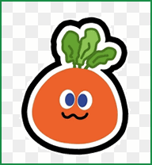
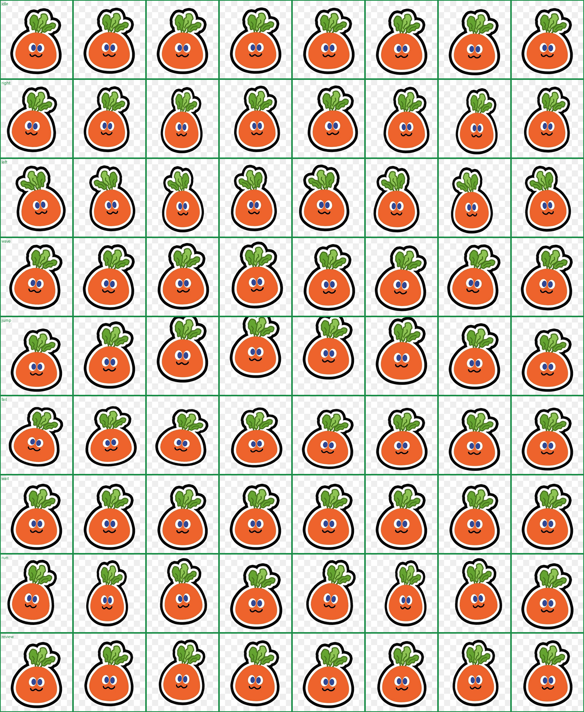

# MOJO Carrot Codex Pet

一个 fan-made 的 Codex Desktop 自定义窗口宠物，把 Codex 的窗口宠物换成圆滚滚的 MOJO Carrot。



## Preview



## Install

```bash
git clone https://github.com/YOUR_GITHUB_USERNAME/mojo-carrot-codex-pet.git
cd mojo-carrot-codex-pet
./install.sh
```

Then restart Codex Desktop, or reload the app if your version supports reloading custom pets.

## Manual Install

Copy the `mojo-carrot` folder into your Codex pets directory:

```bash
mkdir -p "${CODEX_HOME:-$HOME/.codex}/pets"
cp -R mojo-carrot "${CODEX_HOME:-$HOME/.codex}/pets/"
```

Then set this in `${CODEX_HOME:-$HOME/.codex}/config.toml`:

```toml
selected-avatar-id = "custom:mojo-carrot"
```

## Uninstall

```bash
./uninstall.sh
```

The uninstall script removes only the copied `mojo-carrot` pet folder. It does not edit your Codex config.

## Files

- `mojo-carrot/pet.json`: pet metadata
- `mojo-carrot/spritesheet.webp`: 8 x 9 transparent spritesheet
- `previews/contact-sheet.png`: full frame preview
- `previews/motion-preview.gif`: quick motion preview

## Credits and Notice

This is an unofficial fan-made Codex pet for personal use. MOJO CARROT, 五月天/Mayday, and STAYREAL related names, character designs, and artwork belong to their respective rights holders. This repository is not affiliated with, endorsed by, or sponsored by 五月天/Mayday or STAYREAL.

Please do not use this project commercially unless you have permission from the relevant rights holders.
